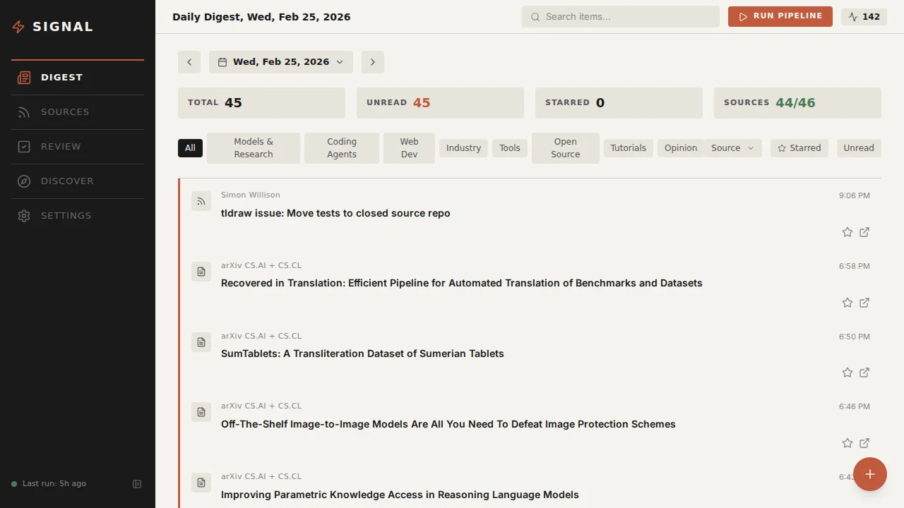
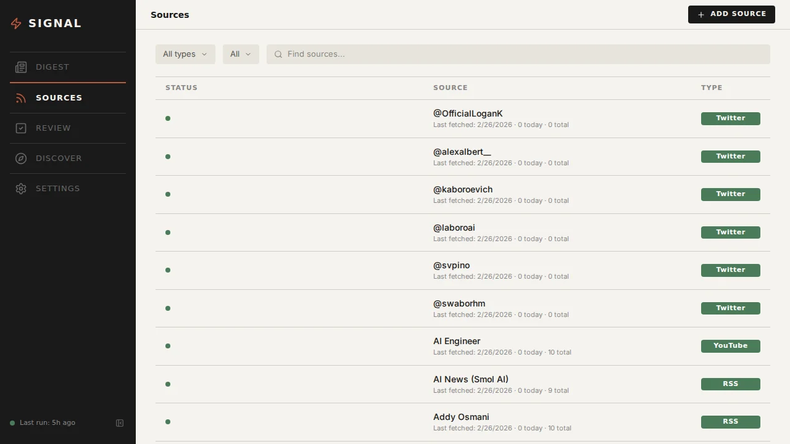
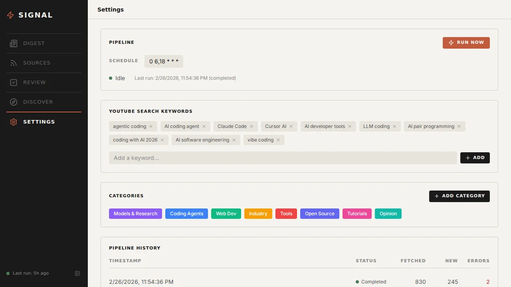
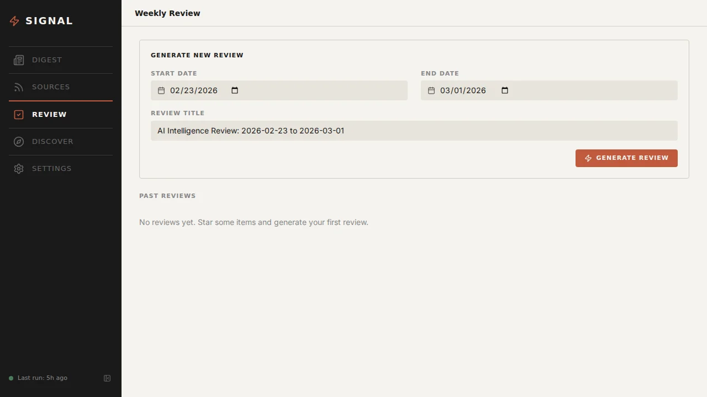

# Signal

A personal news intelligence tool that turns any topic into a curated daily digest. Point it at RSS feeds, YouTube channels, Hacker News, Reddit, arXiv, GitHub, Bluesky — and it fetches, deduplicates, summarizes, and categorizes everything into one feed.

Track AI research, web development, game design, finance, or anything else. You bring the sources, Signal does the rest.



## What It Does

- **Fetches** from RSS/Atom, Hacker News, Reddit, arXiv, GitHub Releases, YouTube, Bluesky, and Twitter (Nitter)
- **Deduplicates** across sources using URL matching, source+ID matching, and fuzzy title similarity
- **Summarizes** each item with an LLM (2-3 sentences + auto-categorization into your custom categories)
- **Presents** a calendar-navigable daily digest with filtering by category, source, and read/starred state
- **Curates** with star + annotate workflow for items worth highlighting
- **Generates** weekly markdown reviews from starred items
- **Discovers** new YouTube channels based on your keyword searches

## Quick Start

```bash
# 1. Start PostgreSQL
docker compose up -d postgres

# 2. Configure
cp backend/.env.example .env
# Edit .env — add your OPENAI_API_KEY (recommended), GOOGLE_API_KEY (for YouTube)

# 3. Start backend
cd backend
uv sync
uv run uvicorn signal_app.main:app --reload --port 8000

# 4. Start frontend (in another terminal)
cd frontend
pnpm install
pnpm run dev
```

Open `http://localhost:3000`. Add your sources via the **Sources** page, then click **RUN NOW** in Settings to fetch your first batch.

## Tech Stack

| Layer | Technology |
|-------|-----------|
| Backend | Python, FastAPI, asyncpg |
| Database | PostgreSQL 17 |
| Frontend | React 19, TanStack Start, Vite 7, Tailwind CSS 4 |
| LLM | OpenAI GPT-4.1-nano |
| Infra | Docker Compose |

## Project Structure

```
signal/
├── backend/
│   └── src/signal_app/
│       ├── main.py               # FastAPI app
│       ├── fetchers/             # 9 source-type fetchers
│       ├── pipeline/             # Orchestrator, dedup, summarizer, scheduler
│       ├── weekly/               # Review markdown generator
│       ├── discovery/            # YouTube channel suggestions
│       └── routes/               # API endpoints
├── frontend/
│   └── src/
│       ├── routes/               # Page components (digest, sources, review, discovery, settings)
│       ├── components/           # Shared UI components
│       └── lib/                  # API client, types, utils
├── docker/
│   └── postgres/init.sql         # Schema (no seeded sources — add your own)
├── docs/                         # Architecture, API, setup, pipeline, sources docs
└── docker-compose.yml
```

## Source Types

| Type | Method | Auth Required |
|------|--------|---------------|
| RSS/Atom | feedparser + httpx | No |
| Hacker News | Algolia API | No |
| Reddit | JSON API | No |
| arXiv | Atom API | No |
| GitHub Releases | REST API v3 | Optional (token for rate limits) |
| YouTube | Data API v3 | Yes (`GOOGLE_API_KEY`) |
| Bluesky | AT Protocol | No |
| Twitter/X | Nitter RSS fallback | No (fragile) |
| Manual | API / Quick Add UI | N/A |

## Pipeline

Runs on a configurable cron schedule (default: 6 AM and 6 PM daily). Can be triggered manually.

```
Fetch (parallel) → Deduplicate (3-layer) → Persist → Summarize (LLM) → Categorize → Discover
```

Cost: ~$0.30/month for LLM summarization at 100 items/day with GPT-4.1-nano.

## API

Full REST API at `http://localhost:8000/api`. Key endpoints:

- `GET /api/items` — list with filtering and pagination
- `PATCH /api/items/{id}` — star, read, annotate, categorize
- `POST /api/items/manual` — quick-add for LinkedIn, etc.
- `POST /api/pipeline/run` — trigger pipeline
- `POST /api/reviews/generate` — generate weekly review
- `GET /api/discovery/channels` — YouTube channel suggestions

See [docs/api.md](docs/api.md) for the full reference.

## Documentation

- [Setup Guide](docs/setup.md)
- [Architecture](docs/architecture.md)
- [API Reference](docs/api.md)
- [Pipeline](docs/pipeline.md)
- [Source Types](docs/sources.md)

## Development

```bash
# Backend tests
cd backend && uv run pytest tests/ -v

# Backend lint
cd backend && uv run ruff check src/

# Frontend build
cd frontend && pnpm run build
```

## Screenshots

**Sources** — manage tracked sources across RSS, YouTube, Twitter, arXiv, Reddit, GitHub, and more. Each shows health status, last fetch time, and item count.



**Settings** — configure pipeline schedule, YouTube search keywords, categories, and view pipeline run history.



**Weekly Review** — generate markdown reviews from starred items for team briefings.



## License

[Apache License 2.0](LICENSE)
